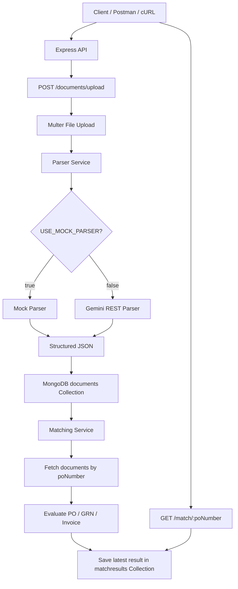
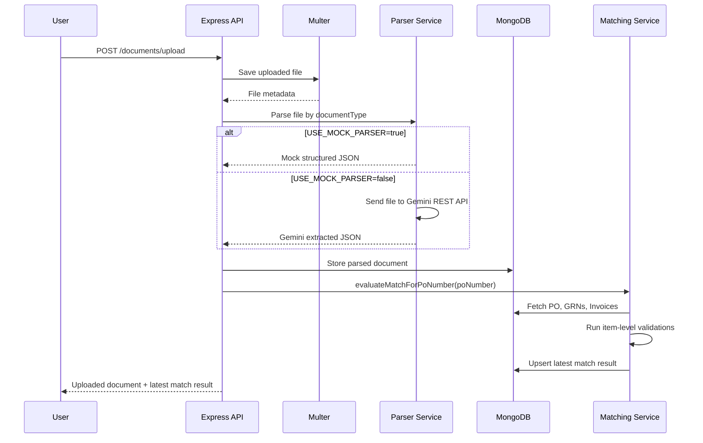
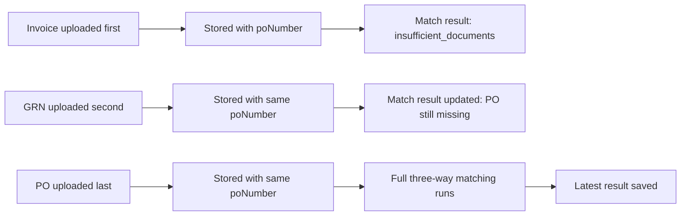

# Three-Way Match Engine for PO, GRN, and Invoice

A backend service for uploading Purchase Order (PO), Goods Receipt Note (GRN), and Invoice documents, extracting structured data, storing the parsed output in MongoDB, and performing item-level three-way matching.

This project was built as part of a backend developer assignment for a fintech use case involving PO, GRN, and Invoice reconciliation.

---

## Table of Contents

* [Overview](#overview)
* [Tech Stack](#tech-stack)
* [Core Features](#core-features)
* [System Architecture](#system-architecture)
* [High-Level Flow](#high-level-flow)
* [Parser Modes](#parser-modes)
* [Why a Mock Parser Fallback Exists](#why-a-mock-parser-fallback-exists)
* [Data Model](#data-model)
* [Matching Logic](#matching-logic)
* [Item Matching Strategy](#item-matching-strategy)
* [Out-of-Order Upload Handling](#out-of-order-upload-handling)
* [API Endpoints](#api-endpoints)
* [API Usage Examples](#api-usage-examples)
* [Setup Instructions](#setup-instructions)
* [Environment Variables](#environment-variables)
* [Testing with Sample Documents](#testing-with-sample-documents)
* [Example Parsed JSON](#example-parsed-json)
* [Example Match Result](#example-match-result)
* [Assumptions](#assumptions)
* [Tradeoffs](#tradeoffs)
* [Future Improvements](#future-improvements)
* [Project Structure](#project-structure)

---

## Overview

The backend allows users to upload three document types:

1. **PO** — Purchase Order
2. **GRN** — Goods Receipt Note
3. **Invoice**

Each document is parsed into structured JSON, stored independently in MongoDB, and linked using `poNumber`.

The matching engine evaluates whether the invoice is valid against the PO and GRN data.

The system supports out-of-order uploads. For example:

* Invoice may arrive before PO
* GRN may arrive before Invoice
* PO may arrive last

The backend stores every parsed document independently and recalculates the latest match state whenever a related document becomes available.

---

## Tech Stack

* **Node.js**
* **Express.js**
* **MongoDB**
* **Mongoose**
* **Multer** for file uploads
* **Gemini REST API** for document parsing
* **dotenv** for environment configuration
* **Docker Compose** for local MongoDB setup

---

## Core Features

* Upload PO, GRN, and Invoice documents
* Parse documents into structured JSON
* Store parsed documents in MongoDB
* Link documents using `poNumber`
* Support one PO, multiple GRNs, and multiple Invoices per PO number
* Handle out-of-order document uploads
* Perform item-level three-way matching
* Return latest match status for a PO number
* Generate detailed mismatch reasons
* Support Gemini parser and deterministic mock parser fallback
* Retry and timeout handling for Gemini API calls

---

## System Architecture



---

## High-Level Flow



---

## Parser Modes

The project supports two parser modes.

### 1. Gemini Parser

When:

```env
USE_MOCK_PARSER=false
```

the backend uses the Gemini REST API to parse uploaded files.

The Gemini parser is implemented in:

```txt
src/services/gemini.service.js
```

It sends the uploaded file as base64 inline data to Gemini with a document-specific prompt.

Supported parser prompts:

* PO extraction prompt
* GRN extraction prompt
* Invoice extraction prompt

The Gemini model can be configured using:

```env
GEMINI_MODEL=gemini-2.5-flash-lite
```

The Gemini service also includes:

* configurable retry count
* configurable timeout
* API error hints
* retry handling for rate limits and temporary service failures
* JSON response cleanup
* parsed data normalization
* numeric field normalization
* HSN-code cleanup for incorrect `matchCode` values

---

### 2. Mock Parser Fallback

When:

```env
USE_MOCK_PARSER=true
```

the backend uses predefined structured sample data based on the provided PO, GRN, and Invoice documents.

The mock parser is implemented in:

```txt
src/services/parser.service.js
```

The mock parser allows deterministic testing of the backend and matching logic without relying on external API availability or OCR variability.

---

## Why a Mock Parser Fallback Exists

The assignment requires document parsing using Gemini. Gemini integration is implemented through the REST API.

However, while testing with the provided real sample PDFs, Gemini extraction showed variability because the documents contain dense tabular data and OCR-sensitive fields.

Observed issues included:

* temporary Gemini model overload / high-demand errors
* inconsistent extraction of PO number
* invoice number being confused with IRN number
* incorrect invoice date extraction
* missing table rows
* quantity or item-code misreads
* HSN/SAC codes being incorrectly returned as matching keys

Because the core backend requirement is to demonstrate document upload, storage, out-of-order handling, and item-level three-way matching, a mock parser fallback was added.

This makes the project testable in two ways:

1. **Gemini mode** — demonstrates external AI parsing integration.
2. **Mock mode** — demonstrates deterministic backend matching logic.

Recommended mode for local reviewer testing:

```env
USE_MOCK_PARSER=true
```

Recommended mode for Gemini API testing:

```env
USE_MOCK_PARSER=false
```

This fallback behavior is clearly separated through environment configuration and does not change the matching engine.

---

## Data Model

The backend uses two main MongoDB collections:

1. `documents`
2. `matchresults`

---

### Document Model

Each uploaded file is stored as one document.

```js
{
  documentType: "po" | "grn" | "invoice",
  poNumber: "CI4PO05788",

  originalFileName: "Invoice.pdf",
  filePath: "uploads/file-...",
  mimeType: "application/pdf",
  fileSize: 167289,

  parsedData: {
    poNumber: "CI4PO05788",
    poDate: "2026-03-17",

    grnNumber: "CI4000020234",
    grnDate: "2026-03-24",

    invoiceNumber: "IN25MH2504251",
    invoiceDate: "2026-03-24",

    vendorName: "M/s AFP",
    customerOrderNumber: "CI4PO05788",

    items: [
      {
        itemCode: "18004",
        sku: null,
        matchCode: null,
        description: "Meatigo Chicken Boneless Breast Frozen 450.0 g",
        hsnCode: "02071300",

        quantity: 540,
        expectedQuantity: null,
        receivedQuantity: null,

        unitPrice: 199.048,
        taxableValue: 107485.71,
        totalAmount: 112860,

        extractionWarning: null
      }
    ],

    rawGeminiResponse: null
  },

  parsingStatus: "success",
  parsingError: null
}
```

---

### Match Result Model

Each `poNumber` has one latest match result.

```js
{
  poNumber: "CI4PO05788",

  status: "matched" | "partially_matched" | "mismatch" | "insufficient_documents",

  documents: {
    po: ObjectId,
    grns: [ObjectId],
    invoices: [ObjectId]
  },

  summary: {
    poItemCount: 3,
    grnItemCount: 3,
    invoiceItemCount: 3
  },

  reasons: [
    {
      code: "invoice_date_after_po_date",
      itemKey: null,
      message: "Invoice date 2026-03-24 is after PO date 2026-03-17",
      details: {}
    }
  ],

  itemResults: [
    {
      itemKey: "18004",
      description: "Meatigo Chicken Boneless Breast Frozen 450.0 g",
      poQuantity: 540,
      grnQuantity: 30,
      invoiceQuantity: 30,
      status: "matched",
      reasons: []
    }
  ],

  lastEvaluatedAt: "2026-06-12T13:03:27.452Z"
}
```

---

## Matching Logic

The matching engine evaluates documents for a given `poNumber`.

Main function:

```txt
evaluateMatchForPoNumber(poNumber)
```

Location:

```txt
src/services/matching.service.js
```

---

### Matching Rules Implemented

The following rules are implemented:

| Rule                                                | Reason Code                                    |
| --------------------------------------------------- | ---------------------------------------------- |
| GRN quantity must not exceed PO quantity            | `grn_qty_exceeds_po_qty`                       |
| Invoice quantity must not exceed total GRN quantity | `invoice_qty_exceeds_grn_qty`                  |
| Invoice quantity must not exceed PO quantity        | `invoice_qty_exceeds_po_qty`                   |
| Invoice date must not be after PO date              | `invoice_date_after_po_date`                   |
| More than one PO for same PO number                 | `duplicate_po`                                 |
| GRN or Invoice item does not exist in PO            | `item_missing_in_po`                           |
| Required documents are missing                      | `po_missing`, `grn_missing`, `invoice_missing` |

---

### Matching Statuses

The engine returns one of:

| Status                   | Meaning                                                 |
| ------------------------ | ------------------------------------------------------- |
| `matched`                | All required documents exist and no mismatch was found  |
| `partially_matched`      | Some items matched, but some item-level mismatch exists |
| `mismatch`               | A document-level or item-level validation failed        |
| `insufficient_documents` | PO, GRN, or Invoice is missing                          |

---

## Item Matching Strategy

The matching is performed at the item level.

The matching key priority is:

```txt
matchCode → itemCode → sku → normalized description
```

### Why `matchCode` exists

The provided documents use different item-code systems.

For example:

* PO and GRN use numeric SKU codes such as `11423`, `18003`, `18004`
* Invoice may use internal item codes such as `FG-M-F-0619`

To handle this, the model supports an optional field:

```txt
matchCode
```

`matchCode` represents a normalized cross-document matching key when available.

In mock parser mode, invoice items use `matchCode` to map invoice item codes back to PO/GRN item codes.

Example:

```js
{
  itemCode: "FG-M-F-0619",
  matchCode: "18004",
  description: "Meatigo Chicken Boneless Breast 450g (5%)",
  quantity: 30
}
```

This means:

```txt
actual invoice item code = FG-M-F-0619
matching key = 18004
```

If `matchCode` is not available, the service falls back to `itemCode`, `sku`, or normalized description.

---

## Out-of-Order Upload Handling

Documents are stored independently.

The order of upload does not matter.

For every upload:

```txt
1. Store uploaded document
2. Extract or parse structured JSON
3. Determine poNumber
4. Save the document in MongoDB
5. Fetch all documents with same poNumber
6. Recalculate latest match result
7. Upsert match result in MongoDB
```

---

### Out-of-Order Flow



---

## API Endpoints

### 1. Upload Document

```http
POST /documents/upload
```

Form-data fields:

| Field          | Type   | Required | Description               |
| -------------- | ------ | -------- | ------------------------- |
| `file`         | File   | Yes      | PO, GRN, or Invoice file  |
| `documentType` | String | Yes      | `po`, `grn`, or `invoice` |

Example:

```bash
curl -sS -X POST http://localhost:5000/documents/upload \
  -F "file=@samples/Invoice.pdf" \
  -F "documentType=invoice" | jq
```

Response includes:

* uploaded document
* parsed data
* latest match result

---

### 2. Get Parsed Document

```http
GET /documents/:id
```

Example:

```bash
curl -sS http://localhost:5000/documents/<DOCUMENT_ID> | jq
```

---

### 3. Get Match Result by PO Number

```http
GET /match/:poNumber
```

Example:

```bash
curl -sS http://localhost:5000/match/CI4PO05788 | jq
```

Response includes:

* linked PO, GRNs, and Invoices
* current match status
* summary counts
* mismatch reasons
* item-level results

---
## API Usage Examples

API usage examples are provided in two ways:

1. cURL commands in this README
2. A Postman collection included in the repository

### Postman Collection

A Postman collection is included for testing all APIs:

```txt
postman/finifi-three-way-match.postman_collection.json
````

### How to use the Postman collection

1. Open Postman.
2. Click **Import**.
3. Select the file:

```txt
postman/finifi-three-way-match.postman_collection.json
```

4. Set the collection variable `baseUrl` to:

```txt
http://localhost:5000
```

The collection includes:

* Health check
* Upload PO document
* Upload GRN document
* Upload Invoice document
* Get parsed document by ID
* Get match result by PO number
* Out-of-order upload demo flow

For file upload requests, select the sample PDF files manually in Postman if the local file path is not automatically resolved.

---

## Setup Instructions

### 1. Clone the repository

```bash
git clone https://github.com/partheevvv/three-way-match-engine
cd finifi-assignment
```

---

### 2. Install dependencies

```bash
npm install
```

---

### 3. Create environment file

Create `.env` in the root directory.

```env
PORT=5000
MONGO_URI=mongodb://localhost:27017/finifi_three_way_match

GEMINI_API_KEY=
GEMINI_MODEL=gemini-2.5-flash-lite
GEMINI_MAX_RETRIES=3
GEMINI_TIMEOUT_MS=30000

USE_MOCK_PARSER=true
```

---

### 4. Start MongoDB with Docker

```bash
docker compose up -d
```

---

### 5. Start the server

```bash
npm run dev
```

Expected output:

```txt
MongoDB connected successfully
Server running on port 5000
```

---

## Environment Variables

| Variable             | Required                      | Default                    | Description                   |
| -------------------- | ----------------------------- | -------------------------- | ----------------------------- |
| `PORT`               | No                            | `5000`                     | Server port                   |
| `MONGO_URI`          | Yes                           | -                          | MongoDB connection URI        |
| `GEMINI_API_KEY`     | Required only for Gemini mode | -                          | Gemini API key                |
| `GEMINI_MODEL`       | No                            | `gemini-2.5-flash`         | Gemini model name             |
| `GEMINI_MAX_RETRIES` | No                            | `3`                        | Retry attempts for Gemini API |
| `GEMINI_TIMEOUT_MS`  | No                            | `30000`                    | Gemini request timeout        |
| `USE_MOCK_PARSER`    | No                            | `true` recommended locally | Enables mock parser fallback  |

---

## Testing with Sample Documents

Place the sample files inside:

```txt
samples/
├── PO.pdf
├── GRN.pdf
└── Invoice.pdf
```

Clear previous test data:

```bash
docker exec -it finifi-mongo mongosh finifi_three_way_match --eval 'db.documents.deleteMany({}); db.matchresults.deleteMany({});'
```

Upload Invoice first:

```bash
curl -sS -X POST http://localhost:5000/documents/upload \
  -F "file=@samples/Invoice.pdf" \
  -F "documentType=invoice" | jq
```

Upload GRN second:

```bash
curl -sS -X POST http://localhost:5000/documents/upload \
  -F "file=@samples/GRN.pdf" \
  -F "documentType=grn" | jq
```

Upload PO last:

```bash
curl -sS -X POST http://localhost:5000/documents/upload \
  -F "file=@samples/PO.pdf" \
  -F "documentType=po" | jq
```

Get final match result:

```bash
curl -sS http://localhost:5000/match/CI4PO05788 | jq
```

---

## Example Parsed JSON

### PO

```json
{
  "poNumber": "CI4PO05788",
  "poDate": "2026-03-17",
  "vendorName": "M/s AFP",
  "items": [
    {
      "itemCode": "11423",
      "description": "Cheesy Spicy Veg Momos 24.0 Pieces",
      "quantity": 50,
      "unitPrice": 220.762,
      "taxableValue": 11038.1,
      "totalAmount": 11590
    },
    {
      "itemCode": "18003",
      "description": "Meatigo Chicken Curry Cut Skinless Frozen 450.0 g",
      "quantity": 120,
      "unitPrice": 141.143,
      "taxableValue": 16937.14,
      "totalAmount": 17784
    },
    {
      "itemCode": "18004",
      "description": "Meatigo Chicken Boneless Breast Frozen 450.0 g",
      "quantity": 540,
      "unitPrice": 199.048,
      "taxableValue": 107485.71,
      "totalAmount": 112860
    }
  ]
}
```

---

### GRN

```json
{
  "grnNumber": "CI4000020234",
  "poNumber": "CI4PO05788",
  "grnDate": "2026-03-24",
  "invoiceNumber": "IN25MH2504251",
  "invoiceDate": "2026-03-24",
  "items": [
    {
      "itemCode": "11423",
      "description": "Spicy Veg Momos 24.0 Pieces",
      "expectedQuantity": 50,
      "receivedQuantity": 50,
      "unitPrice": 220.76,
      "totalAmount": 11590.01
    },
    {
      "itemCode": "18003",
      "description": "Meatigo Chicken Curry Cut Skinless Frozen 450.0 g",
      "expectedQuantity": 120,
      "receivedQuantity": 30,
      "unitPrice": 141.14,
      "totalAmount": 4446
    },
    {
      "itemCode": "18004",
      "description": "Meatigo Chicken Boneless Breast Frozen 450.0 g",
      "expectedQuantity": 540,
      "receivedQuantity": 30,
      "unitPrice": 199.05,
      "totalAmount": 6270.01
    }
  ]
}
```

---

### Invoice

```json
{
  "invoiceNumber": "IN25MH2504251",
  "poNumber": "CI4PO05788",
  "invoiceDate": "2026-03-24",
  "customerOrderNumber": "CI4PO05788",
  "items": [
    {
      "itemCode": "FG-P-F-0503",
      "matchCode": "11423",
      "description": "PSM Cheesy Spicy Vegetable Momos 24Pcs",
      "quantity": 50,
      "unitPrice": 220.76,
      "taxableValue": 11038,
      "totalAmount": 11589.9
    },
    {
      "itemCode": "FG-M-F-0620",
      "matchCode": "18003",
      "description": "Meatigo Chicken Curry Cuts 450g (5%)",
      "quantity": 30,
      "unitPrice": 141.14,
      "taxableValue": 4234.2,
      "totalAmount": 4445.91
    },
    {
      "itemCode": "FG-M-F-0619",
      "matchCode": "18004",
      "description": "Meatigo Chicken Boneless Breast 450g (5%)",
      "quantity": 30,
      "unitPrice": 199.05,
      "taxableValue": 5971.5,
      "totalAmount": 6270.08
    }
  ]
}
```

---

## Example Match Result

```json
{
  "poNumber": "CI4PO05788",
  "status": "mismatch",
  "summary": {
    "poItemCount": 3,
    "grnItemCount": 3,
    "invoiceItemCount": 3
  },
  "reasons": [
    {
      "code": "invoice_date_after_po_date",
      "itemKey": null,
      "message": "Invoice date 2026-03-24 is after PO date 2026-03-17"
    }
  ],
  "itemResults": [
    {
      "itemKey": "11423",
      "description": "Cheesy Spicy Veg Momos 24.0 Pieces",
      "poQuantity": 50,
      "grnQuantity": 50,
      "invoiceQuantity": 50,
      "status": "matched",
      "reasons": []
    },
    {
      "itemKey": "18003",
      "description": "Meatigo Chicken Curry Cut Skinless Frozen 450.0 g",
      "poQuantity": 120,
      "grnQuantity": 30,
      "invoiceQuantity": 30,
      "status": "matched",
      "reasons": []
    },
    {
      "itemKey": "18004",
      "description": "Meatigo Chicken Boneless Breast Frozen 450.0 g",
      "poQuantity": 540,
      "grnQuantity": 30,
      "invoiceQuantity": 30,
      "status": "matched",
      "reasons": []
    }
  ]
}
```

In this sample result:

```txt
Item-level quantity matching passes.
The overall status is mismatch only because the assignment rule says invoiceDate must not be after poDate.
```

---

## Assumptions

1. `poNumber` is the primary linking key across PO, GRN, and Invoice.
2. One PO is expected per `poNumber`.
3. Multiple GRNs and multiple Invoices are allowed for the same `poNumber`.
4. Matching is performed at item level.
5. `matchCode` is used when documents use different item-code systems.
6. If `matchCode` is unavailable, matching falls back to `itemCode`, `sku`, and normalized description.
7. Missing PO, GRN, or Invoice documents result in `insufficient_documents`.
8. A PO item missing from GRN or Invoice is not automatically treated as a mismatch because partial delivery and partial invoicing are valid cases.
9. GRN or Invoice items not found in PO are treated as mismatches.
10. The assignment states that invoice date must not be after PO date, so this validation is implemented exactly as specified.

---

## Tradeoffs

### 1. Gemini Extraction Variability

Gemini parsing works, but real PDF table extraction can vary depending on:

* model availability
* OCR quality
* table layout
* repeated columns
* similar-looking characters
* dense invoice formatting

To avoid blocking backend testing, a mock parser fallback is included.

---

### 2. Mock Parser for Deterministic Testing

The mock parser is not intended as a production replacement for Gemini.

It exists to make the matching engine testable and deterministic for assignment review.

---

### 3. Match Code Support

`matchCode` is introduced to handle documents where item codes differ across PO, GRN, and Invoice.

This improves matching reliability but assumes some normalization or cross-reference is available.

---

### 4. Synchronous Matching

Matching is triggered immediately after upload.

For this assignment scope, synchronous matching is simple and sufficient.

In production, this could be moved to a background job queue.

---

### 5. Stored Latest Match Result

The latest match result is stored in MongoDB instead of calculating everything only on request.

This makes `GET /match/:poNumber` fast and provides an auditable latest state.

---

## Future Improvements

With more time, I would add:

* authentication and user-level document ownership
* Swagger/OpenAPI documentation
* automated tests for matching edge cases
* background queue for Gemini parsing
* confidence score for extracted fields
* manual review workflow for low-confidence extraction
* better PDF table preprocessing
* duplicate document detection
* more robust fuzzy item matching
* frontend dashboard
* pagination for documents
* audit logs for uploaded and matched documents
* cloud file storage such as S3
* support for multiple vendors and organizations
* production-grade error monitoring

---

## Project Structure

```txt
finifi-assignment/
├── src/
│   ├── app.js
│   ├── server.js
│   ├── config/
│   │   └── db.js
│   ├── controllers/
│   │   ├── document.controller.js
│   │   └── match.controller.js
│   ├── middlewares/
│   │   └── upload.middleware.js
│   ├── models/
│   │   ├── document.model.js
│   │   └── matchResult.model.js
│   ├── routes/
│   │   ├── document.routes.js
│   │   └── match.routes.js
│   ├── services/
│   │   ├── gemini.service.js
│   │   ├── matching.service.js
│   │   └── parser.service.js
│   └── utils/
│       └── itemKey.js
├── samples/
│   ├── PO.pdf
│   ├── GRN.pdf
│   └── Invoice.pdf
├── uploads/
├── docker-compose.yml
├── .env.example
├── .gitignore
├── package.json
└── README.md
```

---

## Final Notes

This project focuses on clean backend design and problem-solving rather than production polish.

The key backend concerns addressed are:

* structured document ingestion
* parser abstraction
* Gemini integration
* deterministic fallback
* independent document storage
* out-of-order upload handling
* item-level matching
* clear mismatch reporting
* latest match state retrieval
